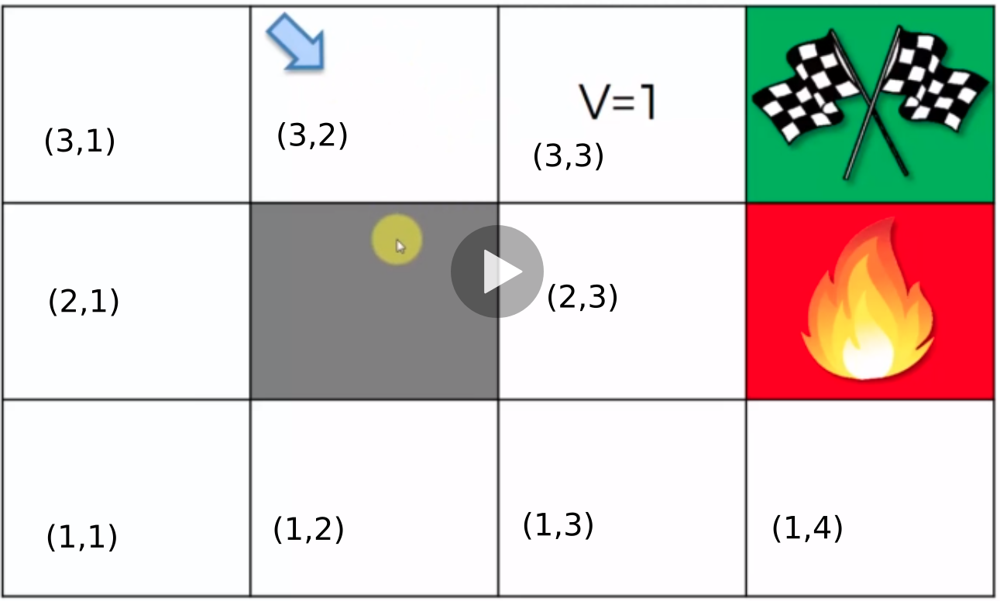
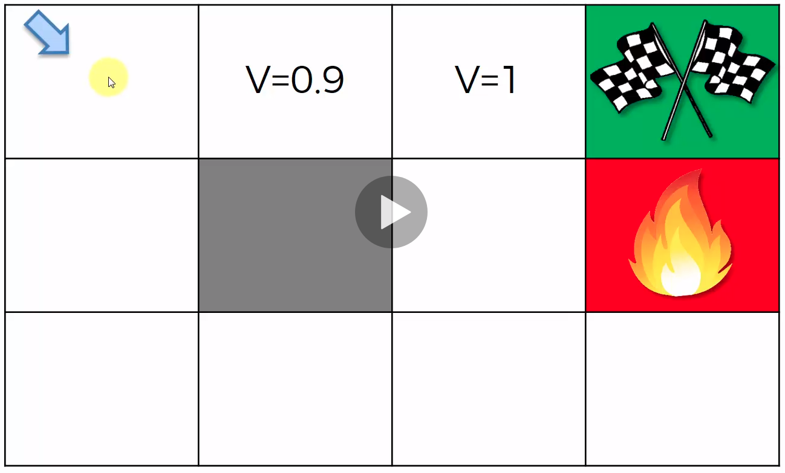
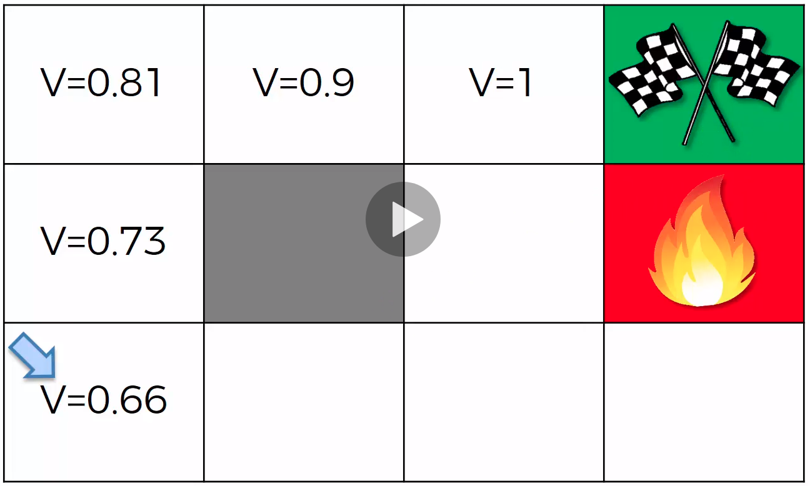
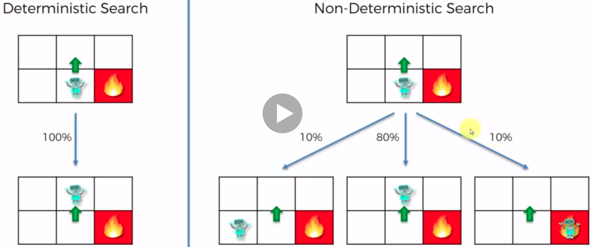
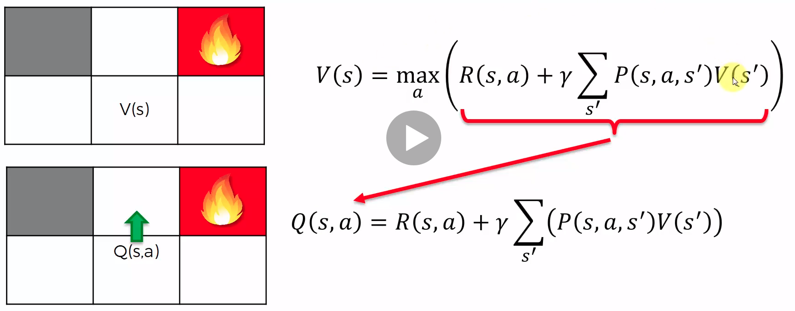
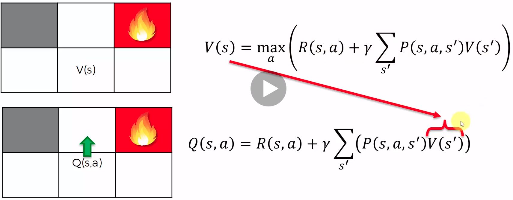
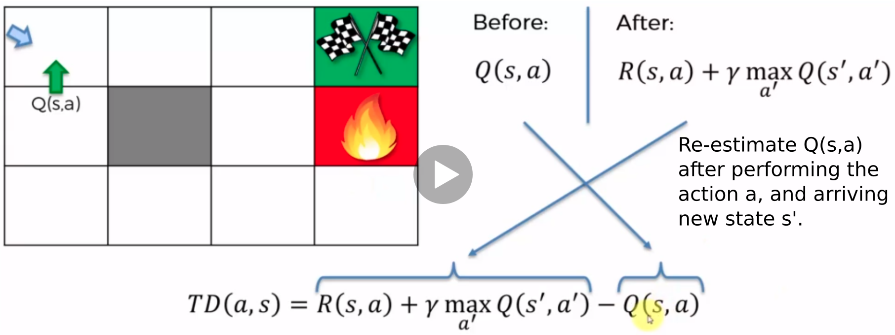
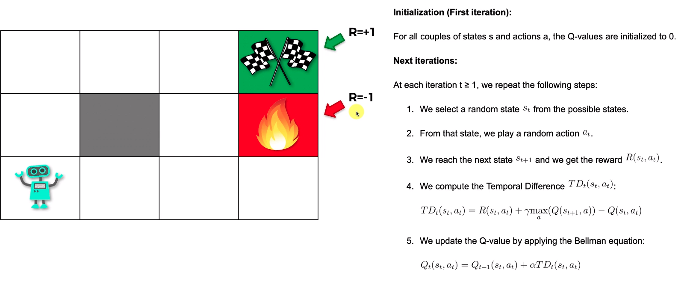

# REINFORCEMENT LEARNING (RL) and Q-LEARNING

### 1. Introduction
RL is a method of learning that uses a reward function to guide the agent in the search for the best path to a goal. 
RL system has the follow components:
+ $s$: **state** describes the observation of the environment. 
+ $a$: **action** descibes how the agent interacts with the environment.
+ $\pi(s)$: **policy** describes the rule that the agent decices to take an action $a$ at the state $s$.
+ $r$: **reward** describes the reward for the agent after performing an action.
+ $\gamma$: **discount factor** describes how much the agent cares about future rewards.
+ $V$: value function 
+ $Q$: (quality) action-value function

### 2. Agent's Learning Objectives: 
+ Each time step $t$, the agent chooses an action based on the current state, he will receive a reward $r_t$.
+ Along the path, by following the policy $\pi$, the total reward $R$ will be accumulated.
    $$R_{\pi} = r_t + \gamma r_{t+1} + \gamma^2 r_{t+2} + \gamma^3 r_{t+3} + \cdots \gamma^T r_{t+T}$$
  where $\gamma$ is the discount factor, which emphasizes the recent rewards are more important than the future ones.  
+ The **ultimate goal** is to achieve the maximum acumulated reward $R$. However, since the environment is stochastic, the agent will not always get the same reward $r_t$ for the same action $a$. Therefore, the accumulated reward $R$ is expressed in term of expectation, which is called **Value**.
    $$V_{\pi}(s) = E[r_t + r_{t+1} + \gamma r_{t+2} + \gamma^2 r_{t+3} + \cdots \gamma^T r_{t+T}|\pi(s)]$$

### 3. How to choose the action?
+  By the learning objective, we should of course choose the action that maximizes the value function. This is expressed by the Bellman equation:
    $$V(s) = \max_a[r(s,a) + \gamma V(s')]$$

In the example below, the agent gets a reward $r=1$ when reaching the goal, $r=-1$ when it gets into fire, and $r=0$ otherwise. We use discount factor $\gamma=0.9$. 

   
   
  

+ We start from near the goal $s=(3,3)$. The value of this state is: $V(s=(3,3)) = 1$, where reward $r=1$ and stop (no further state).
+ Then, we move 1 step backward to the left $s=(3,2)$. The value of this state is: $V(s=(3,2)) = 0 + 0.9*V(s=(3,3))=0.9$.
+ Then, we continue the steps to all other states. 

This procedure is basically the "Dynamic Programing".
+ We build the value map starting from the location nearing goal, and extend to all the other location in the map.
+ From the Value map above, we can easily set the plan to move the agent. 

### 4. What if the environment is uncertain ? 
In the example above, the action is 100% certain, e.g `turn-left` command will definitely move the agent to the left. However, in practice, there are always uncertainties, e.g `turn-left` command will move the agent to the left in 80% cases but $0% cases it can move to the right or forward.

   

To make the problem easier, we requires the process to be an `Markov Process`, that is:

> In Markow process, the future state only depends on the current state, not the sequence in the past.

And the BellMan is rewritten in the stochastic form:

$$V(s) = \max_a[r(s,a) + \gamma \sum_{s'} P(s'|s,a) V(s')]$$

### 5. Q-Learning Intuition

   
   

+ From the Bellman equation, let we define the quality of an action (left-figure) as:
  $$Q(s,a) = r(s,a) + \gamma \sum_{s'} P(s'|s,a) V(s') \Rightarrow V(s) = \max_a[Q(s,a)]$$
  > The value of the state $V(s)$ is the maximum quality of an action $Q(s,a)$.
+ Then substitue $V(s') = \max_a[Q(s',a)]$ (right-figure), we write the Q-function  independent of $V(s)$: 
  $$Q(s,a) = r(s,a) + \gamma \sum_{s'} P(s'|s,a) \max_a[Q(s',a)]$$
+ For short notation, we can ignore the "Stochastic Process" and simplify the Q-function as follows.
  $$Q(s,a) = r(s,a) + \gamma \max_a[Q(s',a)]$$ 

### 6. Temporal Difference (TD)
+ Theoretically, if $Q(s,a)$ is known ahead, then every thing is very easy, we just choose the action that maximizes the quality.
+ However, $Q(s,a)$ is just an estimation, which hopefuylly is getting closer and closer to the true value along the learning path. Therefore, after taking an action, there is always a mismatched from the previous and the re-estimated quality. This ammount of mismatch is called **temporal difference (TD)**.

   

+ And we update the Q-function as follows:
  $$Q_t(s,a) = Q_{t-1}(s,a) + \alpha TD_t(s,a)$$
  Note that, when $\alpha=1$, this reduces to the ideal Bellman equation, i.e. we discard the whole experience learned in the past, and update the Q-function with the latest quality.  However, this is not a good idea, because the new estimated value is not neccesarily the best value representing the state. For example, it may be a rare event due to the random process.   

### 7. Q-Learning Algorithm

   

    