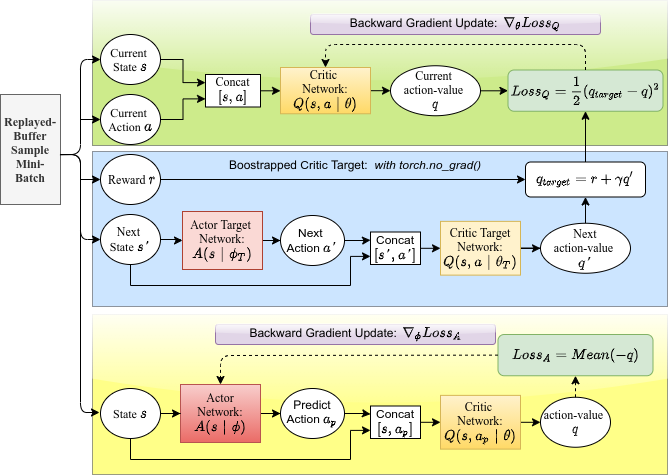
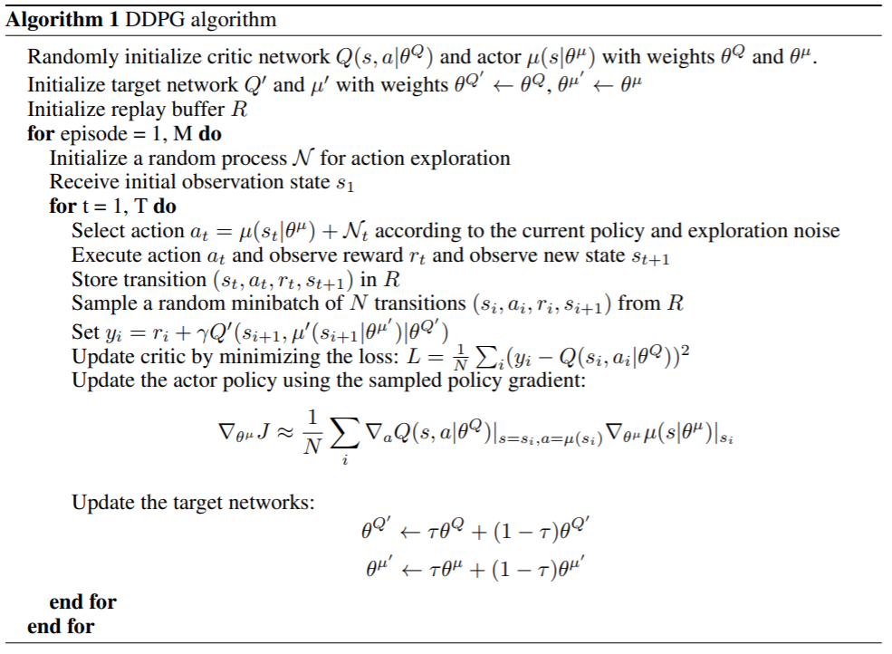
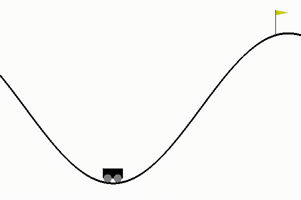

# Deep Deterministic Policy Gradient


> Lillicrap, T.P., Hunt, J.J., Pritzel, A., Heess, N., Erez, T., Tassa, Y., Silver, D. and Wierstra, D., 2015. Continuous control with deep reinforcement learning. arXiv preprint arXiv:1509.02971.

### 1. Motivation
+ While DQN solves the problem with high-dimensional **observation spaces**, it can only handle **discrete** and low-dimensional **action spaces**. 
+ However, interesting problems, such as physical control tasks, have continous and high dimensiona action spaces.
+ An obvious approach to adop DQN to such continous domain is to simply discritize the action space. However, there are many drawbacks:
  + The number of actions increases exponentially with the number of degrees of freedom (DOF). For example, for 7-DOF system, if each action is discretized with 10-bins, then we have $10^7$ number of actions. The situation is even worse if we want to do fine-grained control.
  + Such large action spaces are difficult to explore efficiently, such training DQN is intractable.
  + Naive discritization throws away information about the structure of action domain, which may be essential for solving the problems. 

### 2. Deep Deterministic Policy Gradient
+ Recall that in DQN, we build an action-value function: $Q_{\theta}(s): R^n \rightarrow R^k$ with $n$ is the number of states and $k$ number of discrete actions, to reflect the quality of all possible action $a$ performing at the state $s$. Since we only have $k$ actions, the optimal one can be easily selected as the one with highest value:
    $$a_{opt}=\argmax_{a_i} Q_{\theta}(s)[a_i]$$
+ However, when $a$ is continuous, solving the maximization is no longer easy. A possible way is by taking derivative and set to 0, i.e:
    $$ \nabla_a Q_{\theta}(a_{opt}|s)=0 $$ 
+ In order to solve this, $Q$ must be differentiable w.r.t $a$, and this is exactly how DDPG extends the DQN:
  + Instead of solving $a$ that maximizes $Q$, we create a **policy** network $\pi_{\phi}(s)$ to directly predict the optimal action $a$. For a system with $n$ states, and the agent has $m$ DOF, $\pi_{\phi}(s): R^n \rightarrow R^m$. 
  + Since $a$ is now continuous, we change the value-network to $Q_{\theta}(s,a): R^{n+m} \rightarrow R$, where we simply concatenate $[s,a]$ as the input to $Q_{\theta}(s,a)$.
  + The network $\pi_{\phi}(s)$ is trained to maximize $Q_{\theta}(s, \pi_{\phi}(s))$ simply by gradient descent:
    $$\phi_{t+1} = \phi_t + \alpha \nabla_\phi Expected[-Q_{\theta}(s,\pi_{\phi}(s))]$$
    Note, we use gradient descent on **negative** $Q_{\theta}(s,pi_{\phi}(s)$ since our objective is to **maximize** the expected values $Q$. 
+ Note that, $Q_{\theta}(s, a)$ and $\pi_\phi(s)$ are decoupled, such that:
  + The network $Q_{\theta}(s,a)$ is called `Critic` since it evaluates the quality of action $a$. It is updated exactly as in DQN by treating action $a$ (and so on for $\phi$) as constant. 
  + The network $\pi_{\phi}(s)$ is called `Actor` since it directly makes the action. It is updated by treating $\theta$ as constant. 
  + In training implementation, we used two separated optimizers, one for each network.
  + In inference, only network $\pi_{\phi}(a)$ is used to predict action, and $Q_{\theta}(s,a)$ can be safely discarded. 

### 3. What makes DDPG work:
+ Since DDPG is an extension of DQN, it inherits the keys of DQN, namely `TargetNetwork` and `Replayed Buffer`. 
+ Here, we need two target networks $\pi_{\bar{\phi}}$ and $Q_{\bar{\theta}}$ for the main networks $\pi_\phi$ and $Q_\theta$, respectively. Slightly different with DQN, instead of update the target networks by snapshot of the main networks once every $\tau$ steps, we update it once per main network update by momentum (a.k.a `polyak`) average
    $$ \bar{\theta} \leftarrow \rho \bar{\theta}+ (1-\rho)\theta $$
    $$ \bar{\phi} \leftarrow \rho \bar{\phi} + (1-\rho)\phi $$
    where $\rho \in [0,1]$ is called `polyak`, and often close to 1, .e.g 0.99.
+ An important key of RL is the balance of Exploration vs Exploitation. 
  + Since the actor network $A$ outputs the action directly, we add a small Gaussian noise $N(0,\sigma)$ to the action $a$ for random exploration during training. 
  + In addition, to increase the exploration level, at the first T steps, we can choose the action randomly by uniform sampling from action space.
  + For testing, we stricly follow the policy, and do not add noise to the actions. 

### 4. DDPG Pseudo Code
<p float="center">
  
  
</p>

**To train DDPG agent for Mountain Car Continous problem, do**:

```bash
python tools/train.py configs/DDPG/ddpg_mountaincar_continuous.py
```

Result after training 200 episodes:



