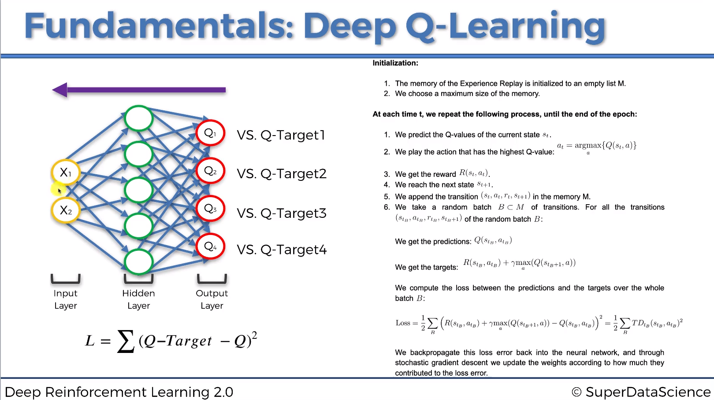

# Deep Q-Learning (DQN)

### 1. Motivation
+ In Q-Learning, we discretize the state spaces, and use a table to record and update the Q-function. 
+ However, most of interesting problems are too large to learn all action values in all states separately. Instead, we can learn a value function $Q_{\theta_t}(a|s)$ parameterized with $\theta$, to predict the value of (discrete) action $a$ at the state $s$.

### 2. Deep Q-Learning
Deep Q-learning uses a Deep Neural Network to approximate Q-function. 
  + For an $n-$dimentional state space $s\in R^n$ and an action space containing $m$ discrete actions, $Q_{\theta_t}(s): R^n \rightarrow R^m$. 
  + So, the value of action $a_i$ is $Q_{\theta_t}(s)[i]$, where $i$ is the row index  $i=1:m$. For convenience, we use the notation $Q_{\theta_t}(a|s)$

Similar to the original Q-Learning, DQN updates the parameters after taking action $a_t$ in the state $s_t$, and observing the immediate reward $r_{t}$ and resulting state $s_{t+1}$. Concretely:

$$\theta_{t+1} = \theta_t + \alpha \frac{1}{2}\nabla _{\theta}(Q_{target} - Q_{\theta}(a_t|s_t))^2 $$,
$$\text{where:} \hspace{1cm} Q_{target}=r_t + \gamma \max_a Q_{\theta}(a|s_{t+1}) $$

+ In theory, $Q_{target}$ should be the **collected rewards in the furture** after we finish this expisode by following this policy. However, "true" $Q_{target}$ is unknown during learning because we haven't finished the episode yet. 
+ Therefore, we boostrap (anticipate) it. Here, only $r_t$ is the new (real) reward, while $\max_a Q_{\theta}(a|s_{t+1})$ is the "pseudo new" rewards, that we extrapolate from old experiences learn in the past. That is why it is called "Boostrap learning".

**Exploitation v.s. Exploration:** Similar to Q-Learning, we use $\epsilon$-greedy policy, for a probability $1-\epsilon$, we select the action that maximizes $Q$, while for a probability $\epsilon$, we randomly sample an action. An additional trick is that, we can use `softmax` probability of Q-values to sample the action, instead of uniform sampling.  
### 3. What makes DQN work?
Two important ingredients of DQN algorithm as proposed by Mnih et. al. (2015) are the use of:
+ **Target Network**, with parameters $\bar{\theta}$, is the same as the online network except that its parameters are copied every $\tau$ steps from the online network, so that $\bar{\theta} \leftarrow \theta$ if $t \% \tau==0$, and keep fixed on all other steps. The target used by DQN is then:
    $$Q_{target}=r_t + \gamma \max_a Q_{\bar{\theta}}(a|s_{t+1}) $$
    In other words, we **freeze the target network** for $\tau$ steps.
+ **Experience Replay**: observed transitions $(s_t,a_t,r_t,s_{t+1})$ are stored for some time and **sampled uniformly** from this memory bank to update the network. This is because, DNN needs to be trained with mini-batch and SDG-like optimizer. If we use only a single sample, e.g the most current one, the network will be easily overfitted, and it cann't generalizes to all the states it saw in the past.  

### 4. DQN Pseudo Code

   

### 5. Double DQN:

+ The idea of Double Q-Learning is to reduce the overestimation by decomposing the $\max_a$ operation in the target into: **action selection** and **action evaluation**.
+ Although not fully decoupled, the target network in the DQN architecture provides a natural candidate for the second value function, without having to introduce additional networks.
+ Double DQN's update is the same as for DQN, but replace the target 
    $$Q_{target}=r_t + \gamma Q_{\bar{\theta}}(a_{opt}|s_{t+1}), \hspace{1cm} \text{where} \hspace{1cm} a_{opt} = \argmax_a Q_{\theta}(a|s_{t+1}) $$
+ Here, the **optimal action** is **selected** by the main network $Q_{\theta}(a|s_{t+1})$, and the **action value** is **evaluated** by the target-network $Q_{\bar{\theta}}(a_{opt}|s_{t+1})$. This leaves the DQN intach, and only modify the way to compute target.

Reference:
1. Mnih, Volodymyr, et al. "Human-level control through deep reinforcement learning." nature 518.7540 (2015): 529-533.
2. Van Hasselt, Hado, Arthur Guez, and David Silver. "Deep reinforcement learning with double q-learning." Proceedings of the AAAI conference on artificial intelligence. Vol. 30. No. 1. 2016.