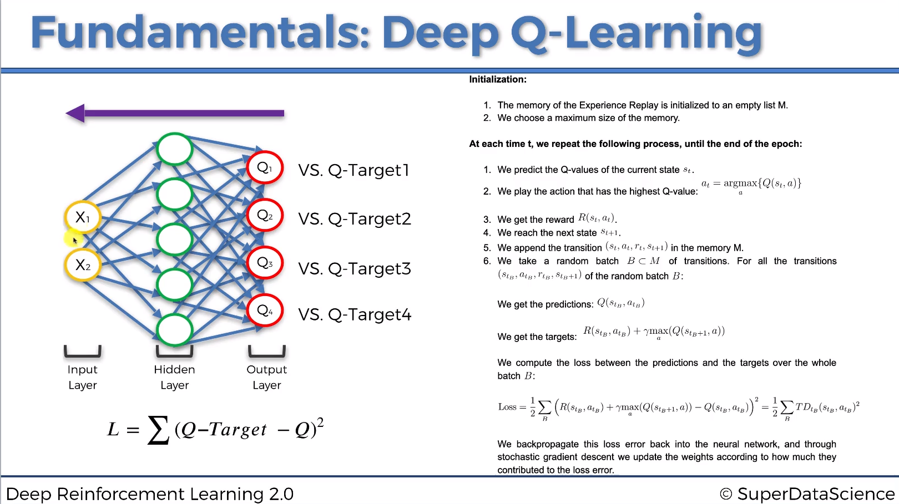

# Deep Q-Learning (DQN)

### 1. Motivation
+ In Q-Learning, we discretize the state spaces, and use a table to record and update the Q-function. 
+ However, most of interesting problems are too large to learn all action values in all states separately. Instead, we can learn a parameterized value function $Q(s,a|\theta_t)$.

### 2. Deep Q-Learning
Deep Q-learning uses a Deep Neural Network to approximate Q-function. For a given state $s$, it outputs a vector of action values $Q(s, \cdot|\theta_t)$. For an $n-$dimentional state space and an action space containing $m$ actions, the neural network is a function from $R^n$ to $R^m$. 

Similar to the original Q-Learning, DQN updates the parameters after taking action $a_t$ in the state $s_t$, and observing the immediate reward $r_{t}$ and resulting state $s_{t+1}$. Concretely:

$$\theta_{t+1} = \theta_t + \alpha \frac{1}{2}\nabla _{\theta}(Q_{target}(s_{t+1},a|\theta) - Q(s_t,a_t|\theta))^2 $$,
where:
$$Q_{target}=r_t + \gamma \max_a Q(s_{t+1},a, \theta) $$

### 3. What makes DQN work?
Two important ingredients of DQN algorithm as proposed by Mnih et. al. (2015) are the use of:
+ **Target Network**, with parameters $\theta^-$, is the same as the online network except that its parameters are copied every $\tau$ steps from the online network, so that $\theta^- \leftarrow \theta$ if $t \% \tau==0$, and keep fixed on all other steps. The target used by DQN is then:
    $$Q_{target}=r_t + \gamma \max_a Q(s_{t+1},a, \theta^-) $$
    In other words, we **freeze the target network** for $\tau$ steps.
+ **Experience Replay**: observed transitions $(s_t,a_t,r_t,s_{t+1})$ are stored for some time and **sampled uniformly** from this memory bank to update the network. This is because, DNN needs to be trained with mini-batch and SDG-like optimizer. If we use only a single sample, e.g the most current one, the network will be easily overfitted, and it cann't generalizes to all the states it saw in the past.  

### 4. DQN Pseudo Code

   

### 5. Double DQN:

+ The idea of Double Q-Learning is to reduce the overestimation by decomposing the $\max_a$ operation in the target into: **action selection** and **action evaluation**.
+ Although not fully decoupled, the target network in the DQN architecture provides a natural candidate for the second value function, without having to introduce additional networks.
+ Double DQN's update is the same as for DQN, but replace the target 
    $$Q_{target}=r_t + \gamma Q(s_{t+1},\max_a Q(s_{t+1},a|\theta), \theta^-) $$
+ Here, the **action selection** is performed by $Q(\theta)$, and the **action evaluation** is performed by $Q(\theta^-)$. This leaves the DQN intach, and only modify the way to compute target.

Reference:
1. Mnih, Volodymyr, et al. "Human-level control through deep reinforcement learning." nature 518.7540 (2015): 529-533.
2. Van Hasselt, Hado, Arthur Guez, and David Silver. "Deep reinforcement learning with double q-learning." Proceedings of the AAAI conference on artificial intelligence. Vol. 30. No. 1. 2016.