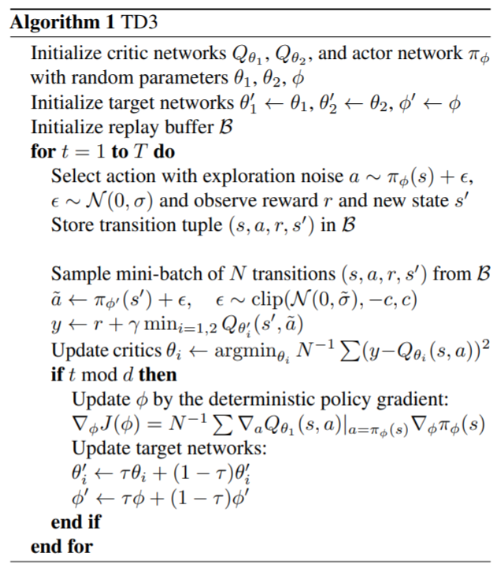

# Twin-Delayed Deep Deterministic Policy Gradient (TD3)

> Fujimoto, S., Van Hoof, H., & Meger, D. (2018). Addressing Function Approximation Error in **Actor**-Critic Methods. 35th International Conference on Machine Learning, ICML 2018, 4, 2587–2601. 

### 1. Motivation
+ In DDPG, we use a Critic network (q-value) to evaluate and train the Actor network (policy), hence the actor's performance strongly depends on how well Critic network estimates the action-value `q`.
+ Due to boostrap learning mechanism, i.e learning by temporal-difference, the `Critic` is subject to estimation error, namely the overestimation bias and high variance build-up.
+ In Double Q-Learning, we know that using an extra Q-network can help reduce this bias. This is the key idea of TD3: We use an extra network Critic, named twin-network, to perform another estimation of `q-value`. By having two Critic networks compete to each other, we can eliviate the over-confident estimation error. 

### 2. Twin-Delayed DDPG (TD3)
+ Compare two DDPG, the main change is  that TD3 uses two Critic networks, namely $Q_1(s,a|\theta_1)$ and $Q_2(s,a|\theta_2)$, which are identical (twin) but with different iniatialized weights $\theta_1$ and $\theta_2$. 
  + Let $Q_{T1}(s',a'|\theta_{T1})$ and $Q_{T2}(s',a'|\theta_{T2})$ be their corresponding target, respectively. 
  + Also, let $A(s|\phi)$ be the Actor network, and $A_T(s'|\phi_T)$ be the Actor-target network.
  
+ We update the `q_target` as follows:
  + From the Replayed-Buffer, we sample a mini-batch $(s,a,r,s')$.
  + We predict the next action for the next state $s'$ using the Actor-target network, disturbed by a small Gaussian noise: 
    $$a'=A_T(s'|\phi_T) + N(0,\sigma)$$
  + We compute two action-values using the twin-Critic Target networks:
    $$q_1 = Q_{T1}(s',a'|\theta_{T1}), q_2 = Q_{T2}(s',a'|\theta_{T2})$$ 
  + We compute the `q_target` by
    $$ q_{target} = r + \gamma \min(q_1,q_2)$$
    The term $\min(q_1,q_2)$ is often referred as `Clipped Double-Q` trick.
+ Then, we update the Critic Networks by:
  + Evaluate the current action-values using the twin-Critic networks:  
    $$q_1 = Q_1(s',a'|\theta_1), q_2 = Q_2(s',a'|\theta_2)$$ 
  + Compute the loss to update the Critic-Networks using MSE loss:
    $$Loss = \frac{1}{2} [ (q_1 -q_{target})^2 + (q_2 - q_{target})^2 ]$$
+ The Actor network $A(s|\phi)$ is trained as done in DDPG, using either one of the Critic, e.g. $Q_1$:
  + We predict the action for the curernt state $s$ using the Actor network: 
    $$a=A(s|\phi)$$
  + Loss for Actor network:
    $$Loss = Mean(-Q_1(s,a|\theta_1))$$

### 3. What makes TD3 works?
+ As mentioned above, using the Twin-Critic Network helps reducing the over-confident estimation for `q_target` value. 
+ An important trick is that, we `delay` updating the Actor and the target networks. For every two iterations, we update them **once**. 

### 4. TD3 Pseudo Code 
<p float="center">
  
  
</p>

**To train DDPG agent for Mountain Car Continous problem, do**:

```bash
python tools/train.py configs/TD3/td3_mountaincar_continuous.py
```

Result after training 260 episodes:


